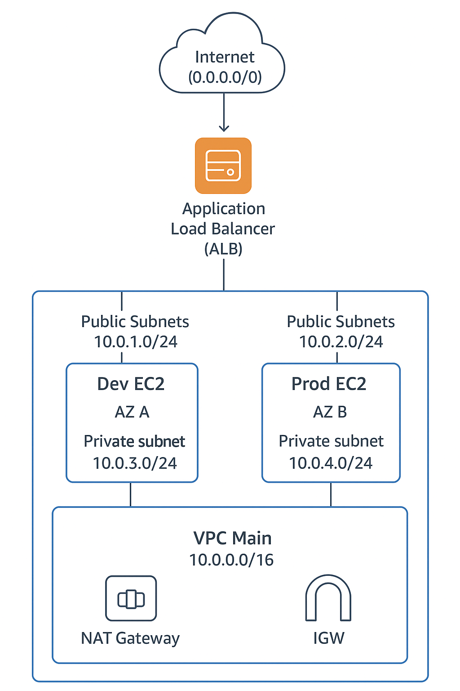

# 🚀 Terraform AWS Infrastructure

Une infrastructure AWS complète et modulaire provisionnée avec Terraform, incluant VPC, instances EC2, Load Balancer et Security Groups pour des environnements de développement et production. Il implémente les bonnes pratiques du Cloud en matière de sécurité, haute disponibilité et gestion des coûts.

# Public Cible

- 🧑‍💻 Développeurs souhaitant déployer des applications

- 👨‍🔧 DevOps Engineers cherchant une base d'infrastructure

- 🏢 Startups ayant besoin d'une infrastructure scalable

- 🎓 Étudiants apprenant l'Infrastructure as Code

## 🏗️ Description

Ce projet Terraform provisionne une infrastructure AWS complète et modulaire comprenant :

- **VPC** avec sous-réseaux publics et privés
- **Instances EC2** pour les environnements de développement et production
- **Load Balancer** applicatif (ALB) avec health checks
- **Security Groups** configurés avec les bonnes pratiques
- **Internet Gateway** et tables de routage
- **Scripts d'automatisation** pour le déploiement et la destruction

## 🏛️ Architecture

### Diagramme d'Architecture

  

### Composants Déployés

## ☁️ Composants d'Infrastructure et Coûts Estimés

| Composant | Description | Coût Estimé |
| :--- | :--- | :--- |
| **VPC** | Réseau virtuel isolé | Gratuit |
| **2x EC2 Instances** | Serveurs web (dev/prod) | ~$15/mois |
| **Application Load Balancer** | Répartition de charge | ~$16/mois |
| **4x Sous-réseaux** | 2 publics + 2 privés | Gratuit |
| **Security Groups** | Règles de sécurité | Gratuit |
| **Internet Gateway** | Connexion Internet | Gratuit |

## ⚙️ Prérequis

- Outils Requis

- Terraform >= 1.0.0

- AWS CLI version 2

- Compte AWS avec permissions appropriées

- SSH Key Pair pour accéder aux instances

## 📁 Structure du Projet

  

## 🚀 Workflows de Déploiement

1️⃣  Cloner le repository
     git clone https://github.com/ton-utilisateur/terraform-aws-infra.git
     cd terraform-aws-infra

2️⃣  Configurer les variables
     - Copier le fichier `terraform.tfvars.example` vers `terraform.tfvars`
     - Modifier les valeurs selon ton environnement

3️⃣  Créer la Key Pair AWS
     - Créer une clé dans la console AWS (ex: Terraform.pem)
     - Placer son nom dans `variables.tf` ou `terraform.tfvars`

4️⃣  Se positionner sur l’environnement cible
     cd environments/dev    # ou cd environments/prod

5️⃣  Initialiser Terraform
     terraform init

6️⃣  Valider la configuration
     terraform validate

7️⃣  Appliquer le déploiement
     terraform apply -auto-approve

8️⃣  Supprimer l’infrastructure (si nécessaire)
     terraform destroy -auto-approve

## 🔒 Sécurité

Bonnes Pratiques Implémentées

✅ Isolation réseau - Instances dans des sous-réseaux privés

✅ Security Groups restrictifs - Règles minimales nécessaires

✅ Pas d'IPs publiques sur les instances backend

✅ Accès SSH restreint - Seulement depuis le LB

✅ Load Balancer sécurisé - Terminaison TLS possible

✅ Tags de sécurité - Identification claire des ressources